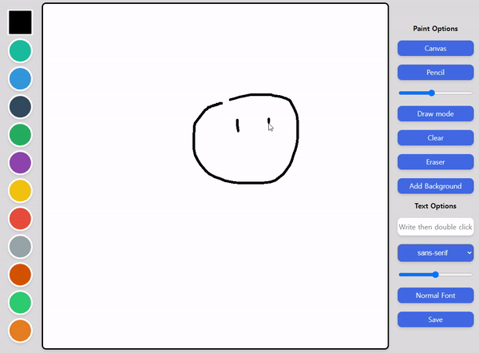
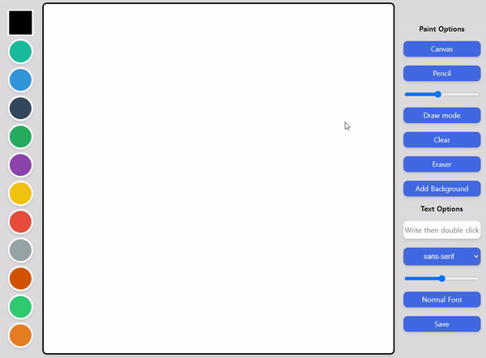
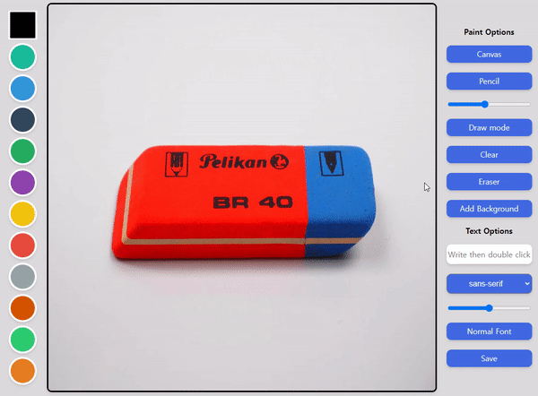
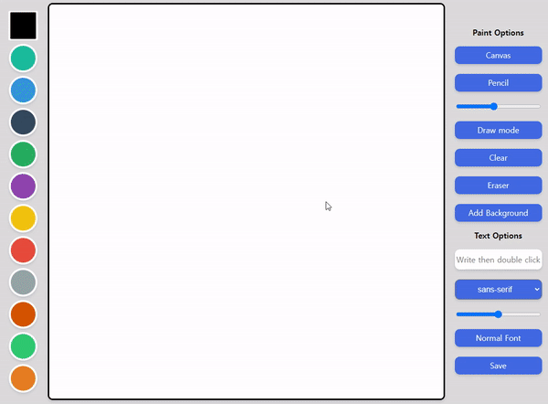
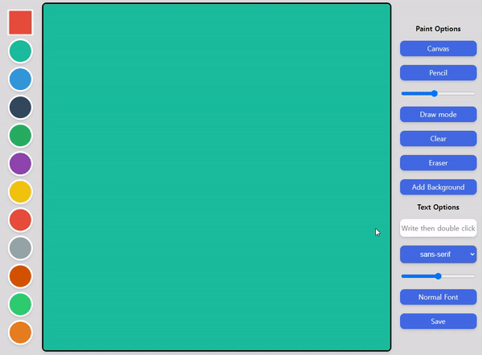

# Meme Maker with JS

The Painting Board made with VanillaJS.

- JavaScript
- Canvas

### **[Start](https://hwahyeon.github.io/js-mememake/)**    

## Select a Color

 

## Canvas Mode
Two main modes are provided. `Canvas` mode is the default. For [the other](./main#festival), see below.

### Pencil Mode
You can set the thickness and color of the `Pencil`.

### Snare Mode
You can draw by moving the mouse like a `Snare`.
Pencil mode is the default. If you want to use this `Snare` mode, click the `Pencil` button on the right.

### Draw / Fill
You can fill the canvas with any color you like.

 

### Clear
You can erase everything on the canvas. Click the `Clear` button on the right

### Eraser

 

## Add Background

 

## Text
If you want to put some text on the canvas, type your text in the blank box on the right side and then double-click on the canvas.

### Font
Four fonts are provided.
* sans-serif
* cursive
* fantasy
* 맑은 고딕

### Size

### Outline

## Save
You can save your work by clicking the **`Save`** button.

## Festival
Pencil, Snare mode is not available in this mode.  
**Enjoy!**

